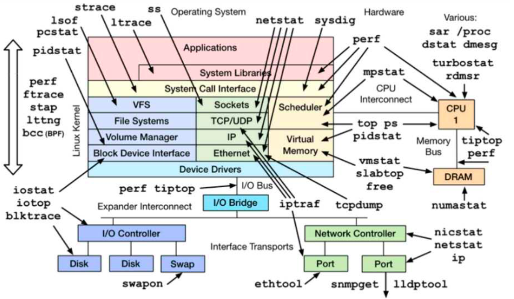

# Linux Performance Tools

|level|level |level|command|
|---|---|---|---|
|operating system||||
|applications||||
|system libraries|||ltrace、perf|
|system call interface|||strace 、sysdig、perf|
|vfs|sockets|scheduler|lsof / ss / mpstat、perf、top ps|
|file systems|tcp/udp|scheduler||
|volume manager| ip|virtual memory||
|block device interface| ethernet|virtual memory||
|device drivers||||
|I/O bridege||||
|I/O Controller|network controller|||
|disk\disk\swap|port/port|||

origin

