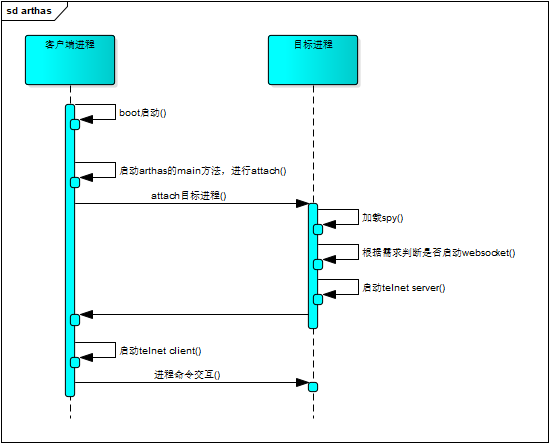

# Arthas相关原理

## 简单的介绍
Arthas是一款诊断、监控工具。主要是利用javaagent加载到目标进程，然后进行一些诊断监控、日志、编译等操作。

## Arthas 的模块

Artahas 可以分为以下几个模块

### Boot模块
boot模块也叫启动模块，jar包的名称叫做arthas-boot.jar。
```bash 
##启动方式
java -jar arthas-boot.jar
```
该模块主要负责的工作。
1、资源下载

具体模块如下：

```bash
arthas-agent.jar
arthas-client.jar	
arthas-demo.jar		
arthas.properties	
as.bat			
async-profiler
logback.xml
arthas-boot.jar		
arthas-core.jar		
arthas-spy.jar		
as-service.bat		
as.sh			
install-local.sh
```

各个模版的版本与arthas-boot.jar的版本是一致的。

2、选择需要监控的PID

3、启动core模块的（使用ProcessBuilder启动core模块Arthas.main）

4、启动cleint模块的telnet客户端。

### Core模块

该模块的负责的工作如下：

1、启动attach（使用VirtualMachine进行attach目标pid）

2、在目标进程中运行telnet server 端。

3、运行的基础依赖包。（提供监控、诊断、日志等基础功能）


### Agent模块

1、在目标进程中启动加载spy模块。

2、启动core模块的ArthasBootstrap.bind。（websocket的客户端以及telnet的server端）


### client模块
1、完成telnet客户端的相关功能，与目标进程进行交互。


### 其他

async-profiler 中提供了生成火焰图需要调用.so文件。


## Arthas的工作原理

arthas主要由两个进程（这里暂时不涉及websocket的服务端）组成：客户端进程以及服务端进程。

1、客户端进程是由boot模块启动加载。

2、服务器进程是需要attach的目标进程。

下面看下两个进程的交互，与上面各个模块的功能对应起来，方便对arthas有一个更加直观的了解。



后续我们对arthas的各个命令进行详解。