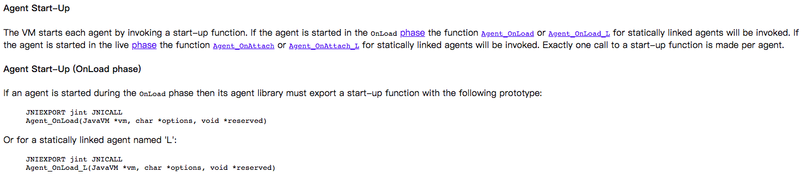

# JavaAgent

由于arthas使用javaagent的技术，因此这里对javaagent做一些简单的介绍。

## javaagent的简单示例

```java
//java -javaagent 会执行premain方法，此处premain方法的入参为string，并非string数组。
public static void premain(String args, Instrumentation inst) {
        main(args, inst);
}
//在java允许过程中，attach agent会执行 agentmain方法。
public static void agentmain(String args, Instrumentation inst) {
			main(args, inst);
}
```
javaagent也可以通过远程方式进行attach

## 关于Instrumentation

Instrumentation给应用程序提供了拦截类加载、修改字节码的手段。

具体的做法：

1、通过Instrumentation调用addTransformer方法。

```java
void addTransformer(ClassFileTransformer transformer, boolean canRetransform);
```

2、实现ClassFileTransformer

```java
public class Enhancer implements ClassFileTransformer {
  @OverWrite
  public byte[] transform(final ClassLoader inClassLoader, String className, Class<?> classBeingRedefined,
                    ProtectionDomain protectionDomain, byte[] classfileBuffer){
    
  }
}
```

针对已经加载的类可以通过```retransform```、 ```redefine```

### redefine

主要是针对需要针对线上的bug进行修复，舍弃原有的字节码，重新生成。

### retransform & removeTransformer
retransform 方法可以增强某个已经加载的类。
removeTransformer方法可以去除某个类的增强。

## JavaAgent

```html
Java Agent的功能都是通过JVMTI Agent也就是C Agent来实现的。JVMTI是一个事件驱动的工具实现接口。通常，我们会在C Agent 加载后的入口方法Agent_OnLoad 处注册各个事件的钩子(hook)方法。当 Java 虚拟机触发了这些事件时，便会调用对应的钩子方法。
```
具体可以参考Oracle官方的说明：https://docs.oracle.com/en/java/javase/11/docs/specs/jvmti.html#EventIndex
