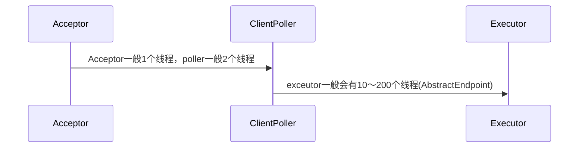
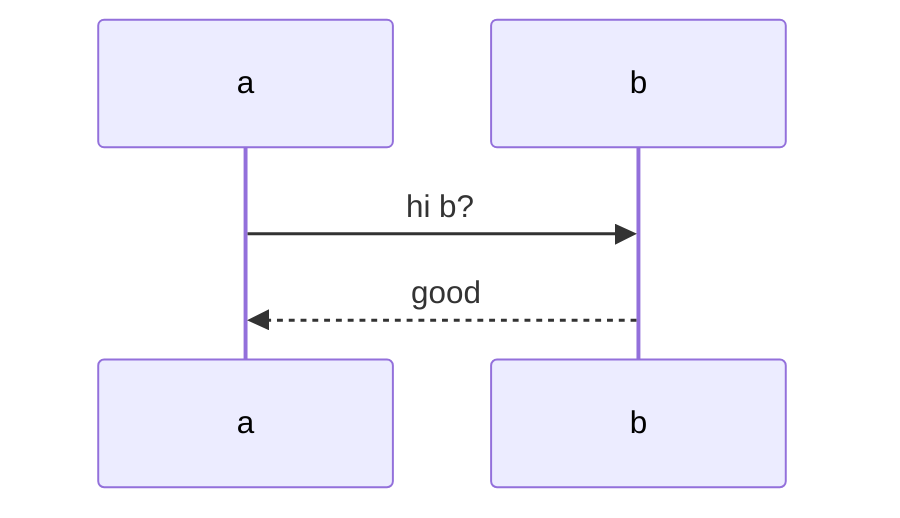
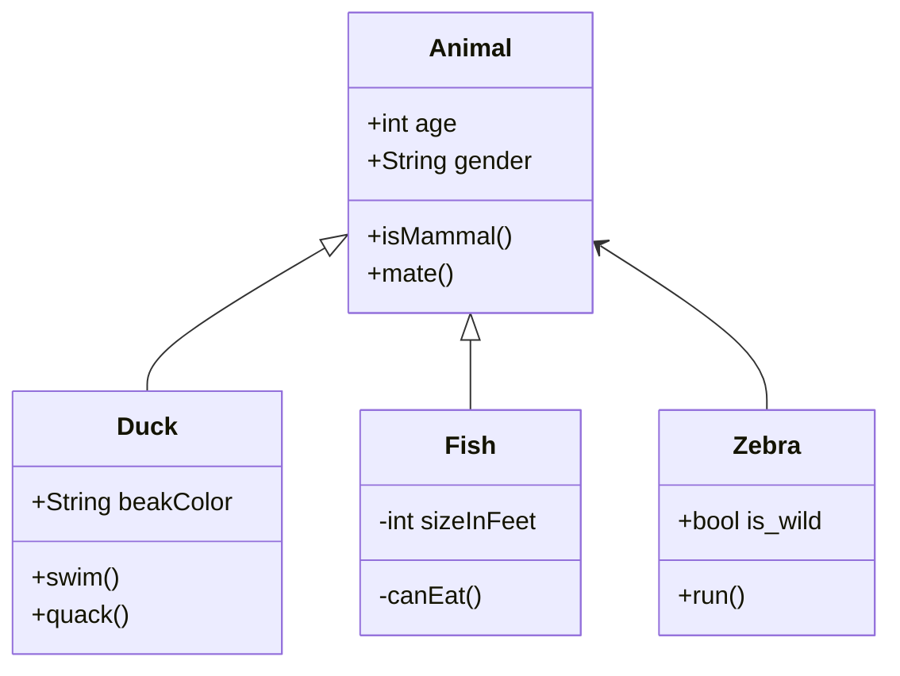
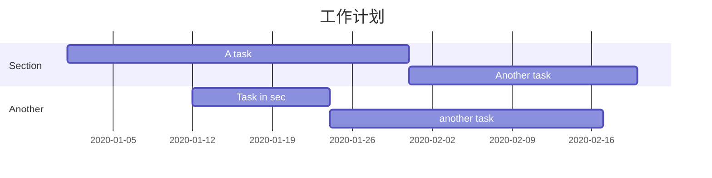
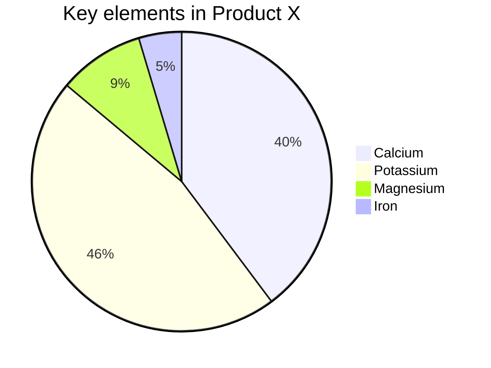

# Tomcat & Undertow

在生产环境使用undertow代替了springboot，观察了两天发现在tomcat容器中一个接口的平均耗时在40ms左右，在undertow容器中平均耗时仅有20ms，这个提升太大了，现在想搞出清楚为什么会出现这么高的提升。应用层代码是未做任何改动的，唯一的影响因素应该就是web容器接受、处理请求的环节。

## Tomcat

tomcat 有三种四中实现方式，apr、nio、nio2.

```java
//nio 实现
ServerSocketChannel.open()
//nio2实现
AsynchronousServerSocketChannel.open(threadGroup);
```


具体流程如下：




### 核心代码

```java
//启动核心线程
@Override
    public void startInternal() throws Exception {

        if (!running) {
            running = true;
            paused = false;

            processorCache = new SynchronizedStack<>(SynchronizedStack.DEFAULT_SIZE,
                    socketProperties.getProcessorCache());
            eventCache = new SynchronizedStack<>(SynchronizedStack.DEFAULT_SIZE,
                            socketProperties.getEventCache());
            nioChannels = new SynchronizedStack<>(SynchronizedStack.DEFAULT_SIZE,
                    socketProperties.getBufferPool());

            // Create worker collection
            if ( getExecutor() == null ) {
                createExecutor();
            }

            initializeConnectionLatch();

            // Start poller threads
            pollers = new Poller[getPollerThreadCount()];
            for (int i=0; i<pollers.length; i++) {
                pollers[i] = new Poller();
                Thread pollerThread = new Thread(pollers[i], getName() + "-ClientPoller-"+i);
                pollerThread.setPriority(threadPriority);
                pollerThread.setDaemon(true);
                pollerThread.start();
            }

            startAcceptorThreads();
        }
    }

```


```java
public boolean processSocket(SocketWrapperBase<S> socketWrapper,
            SocketEvent event, boolean dispatch) {
        try {
            if (socketWrapper == null) {
                return false;
            }
            SocketProcessorBase<S> sc = processorCache.pop();
            if (sc == null) {
                sc = createSocketProcessor(socketWrapper, event);
            } else {
                sc.reset(socketWrapper, event);
            }
            Executor executor = getExecutor();
            if (dispatch && executor != null) {
            		//执行http请求
                executor.execute(sc);
            } else {
                sc.run();
            }
        } catch (RejectedExecutionException ree) {
            getLog().warn(sm.getString("endpoint.executor.fail", socketWrapper) , ree);
            return false;
        } catch (Throwable t) {
            ExceptionUtils.handleThrowable(t);
            // This means we got an OOM or similar creating a thread, or that
            // the pool and its queue are full
            getLog().error(sm.getString("endpoint.process.fail"), t);
            return false;
        }
        return true;
    }
```
## Undertow

默认底层传输采用jdk的nio模式，当然也可以使用 https://github.com/xnio/xnio-native 来实现更加高效传输。

```java
//nio实现
final ServerSocketChannel serverChannel = ServerSocketChannel.open();
serverChannel.configureBlocking(false);
```


接收到任务的处理方式如下：

 ```mermaid
 sequenceDiagram;
 Accept->>XNIO: 1个Accept线程存在8个XNIO处理线程,通过hash算法固定每个客户的XNIO处理线程
 XNIO->>Task:  1个XNIO处理线程存在64个任务处理线程
 ```


具体实现代码如下：

```java
protected AcceptingChannel<StreamConnection> createTcpConnectionServer(final InetSocketAddress bindAddress, final ChannelListener<? super AcceptingChannel<StreamConnection>> acceptListener, final OptionMap optionMap) throws IOException {
        checkShutdown();
        boolean ok = false;
  //打开channel
        final ServerSocketChannel channel = ServerSocketChannel.open();
        try {
            if (optionMap.contains(Options.RECEIVE_BUFFER)) channel.socket().setReceiveBufferSize(optionMap.get(Options.RECEIVE_BUFFER, -1));
            channel.socket().setReuseAddress(optionMap.get(Options.REUSE_ADDRESSES, true));
            channel.configureBlocking(false);
          //绑定地址
            if (optionMap.contains(Options.BACKLOG)) {
                channel.socket().bind(bindAddress, optionMap.get(Options.BACKLOG, 128));
            } else {
                channel.socket().bind(bindAddress);
            }
            if (false) {
                final NioTcpServer server = new NioTcpServer(this, channel, optionMap);
                server.setAcceptListener(acceptListener);
                ok = true;
                return server;
            } else {
              //创建自定一的QueuedNioTcpServer
                final QueuedNioTcpServer server = new QueuedNioTcpServer(this, channel, optionMap);
                server.setAcceptListener(acceptListener);
                ok = true;
                return server;
            }
        } finally {
            if (! ok) {
                IoUtils.safeClose(channel);
            }
        }
    }
```

QueuedNioTcpServer的关键实现如下：

```java
QueuedNioTcpServer(final NioXnioWorker worker, final ServerSocketChannel channel, final OptionMap optionMap) throws IOException {
        super(worker);
        this.channel = channel;
        this.thread = worker.getAcceptThread();
        final WorkerThread[] workerThreads = worker.getAll();
        final List<BlockingQueue<SocketChannel>> acceptQueues = new ArrayList<>(workerThreads.length);
        for (int i = 0; i < workerThreads.length; i++) {
            acceptQueues.add(i, new LinkedBlockingQueue<SocketChannel>());
        }
        this.acceptQueues = acceptQueues;
        socket = channel.socket();
        if (optionMap.contains(Options.SEND_BUFFER)) {
            final int sendBufferSize = optionMap.get(Options.SEND_BUFFER, DEFAULT_BUFFER_SIZE);
            if (sendBufferSize < 1) {
                throw log.parameterOutOfRange("sendBufferSize");
            }
            sendBufferUpdater.set(this, sendBufferSize);
        }
        if (optionMap.contains(Options.KEEP_ALIVE)) {
            keepAliveUpdater.lazySet(this, optionMap.get(Options.KEEP_ALIVE, false) ? 1 : 0);
        }
        if (optionMap.contains(Options.TCP_OOB_INLINE)) {
            oobInlineUpdater.lazySet(this, optionMap.get(Options.TCP_OOB_INLINE, false) ? 1 : 0);
        }
        if (optionMap.contains(Options.TCP_NODELAY)) {
            tcpNoDelayUpdater.lazySet(this, optionMap.get(Options.TCP_NODELAY, false) ? 1 : 0);
        }
        if (optionMap.contains(Options.READ_TIMEOUT)) {
            readTimeoutUpdater.lazySet(this, optionMap.get(Options.READ_TIMEOUT, 0));
        }
        if (optionMap.contains(Options.WRITE_TIMEOUT)) {
            writeTimeoutUpdater.lazySet(this, optionMap.get(Options.WRITE_TIMEOUT, 0));
        }
        final int highWater;
        final int lowWater;
        if (optionMap.contains(Options.CONNECTION_HIGH_WATER) || optionMap.contains(Options.CONNECTION_LOW_WATER)) {
            highWater = optionMap.get(Options.CONNECTION_HIGH_WATER, Integer.MAX_VALUE);
            lowWater = optionMap.get(Options.CONNECTION_LOW_WATER, highWater);
            if (highWater <= 0) {
                throw badHighWater();
            }
            if (lowWater <= 0 || lowWater > highWater) {
                throw badLowWater(highWater);
            }
            final long highLowWater = (long) highWater << CONN_HIGH_BIT | (long) lowWater << CONN_LOW_BIT;
            connectionStatusUpdater.lazySet(this, highLowWater);
        } else {
            highWater = Integer.MAX_VALUE;
            lowWater = Integer.MAX_VALUE;
            connectionStatusUpdater.lazySet(this, CONN_LOW_MASK | CONN_HIGH_MASK);
        }
        final SelectionKey key = thread.registerChannel(channel);
        handle = new QueuedNioTcpServerHandle(this, thread, key, highWater, lowWater);
        key.attach(handle);
        mbeanHandle = NioXnio.register(new XnioServerMXBean() {
            public String getProviderName() {
                return "nio";
            }

            public String getWorkerName() {
                return worker.getName();
            }

            public String getBindAddress() {
                return String.valueOf(getLocalAddress());
            }

            public int getConnectionCount() {
                return handle.getConnectionCount();
            }

            public int getConnectionLimitHighWater() {
                return getHighWater(connectionStatus);
            }

            public int getConnectionLimitLowWater() {
                return getLowWater(connectionStatus);
            }
        });
    }
```


 ```mermaid
 graph TD;
   a-->b;
   a-->c;
   b-->d;
 ```







